# 3 types of models
All the ML techniques can be put into another 3 categories.
- Instance based classifiers
    - Uses observations directly without models
    - The only one we have that does this is KNN
- Generative
    - Build a generative statistical model by assuming data comes from a normal distrobution
    - Bayes classifiers
- Discriminative
    - Directly estimate decision rule/boundary
    - Decision trees
---
# Reminder about probability theory 
This is how bayies 
## Variables 
The basis of baiyes probability theory lies with **random variables** that represent events in the future that could happen. These refer to an element whose status is unknown. For example ```A = "it will rain tomorrow"``` 

The **domain** is the set of values a random variable can take, also to be seen as the set all the possible answers to a question, or all the possible events that could happen. This can be the following types:
**Binary**: Will it rain? (yes, no)
**Discrete**: How much will it rain? Integers (With numbers), 
**Continues**: How much more did it rain today? Floating points (With change and )

Then we define the P() function which will give you the chance of a certain event happening. 

P() has these rules:
> 1. 0 <= P(A) <= 1  
> The output is always between 0 and 1.

> 2. P(True) = 1, P(false) = 0  
> true = 1, false = 0

> 3. P(A ∪ B) = P(A) + P(B) - P(A ∩ B) 
> Set Theory. The chance for A AND B is P(A) + P(B) - P(A) ∩ P(B) 
> So A AND B is P(A) + P(B) - (What A and B have in common)  


How likely one certain outcome is, is called the **prior**. So the the outcome of a P() is a prior. For example:
- P(Rain tomorrow) = 0.8
- P(No rain tomorrow) = 0.2 
The probability of at least something happening is 1. So the sum of P() for all possible outcomes is one.

So a prior is the degree that you believe a certain outcome before it happens and one is chosen. If you have no other information. 

## Example

|Red| Blue|
|---|:---:|
| 1 |  0  |
| 0 |  1  |    
| 1 |  0  |
| 0 |  0  |
| 1 |  0  |
| 0 |  1  |
| 1 |  1  |

Here P(Red) = 0.5 or 4/8 and P(Blue) = 0.5

## Joint probability
This is where you want to know the prior for A and B or P(Red) and P(Blue) or P(A, B) or P(Red, Blue). It is the chance that multiple events happen together. 
In this case it is = 1/8

Now it is very important if the variables are independent or not. If something is independent then the joint probability is just P(A) * P(B). If it is not independent then you need to talk about conditional probability. 

## Conditional probability
In some cases given knowledge of one or more random variables we can improve our prior belief of another random variable. As soon as you know that variables are not independent you need to talk about conditional probability.  

This is where `|` comes in. (A = 1|B = 1) this asks the question of:
> What is the chance that if B happens A also happens the outcomes where A is 
true if B is true. You could say this as the chance of A given B. 

The joint distribution can be specified in terms of conditional probability.

> You can then combine these two to get the joint probability.
> It looks like this: `P(x,y) = P(x|y)*P(x)`

## Bayes Probability Theorom

It turns out that the joint probability of A and B is the prior of A times the conditional probability of A and B. So `P(a,b) = P(a|b)*P(a)`

Now that is really great because we now we can make the bayes rule:
From joint probability we can say `P(x,y) = P(x|y)p(y) = P(y|x)P(x)` and this gives us conditional probability. 

> It looks like so:
> `p(y|x) = p(x|y)p(y)/p(x)`

Now if we put this back into ML terms. x = features, y = label.
> P(y|x) --> What is the chance for this label y given features x

### Example
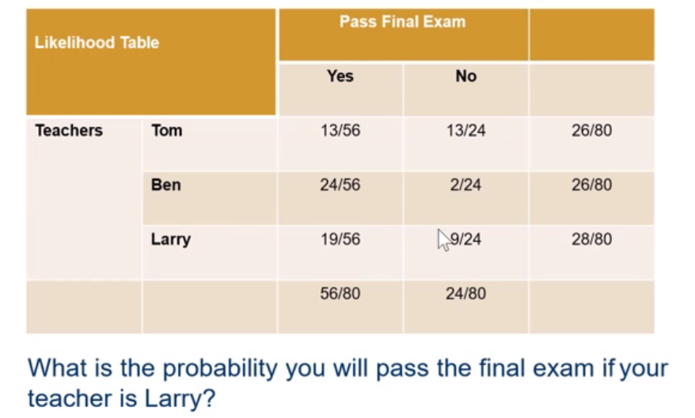 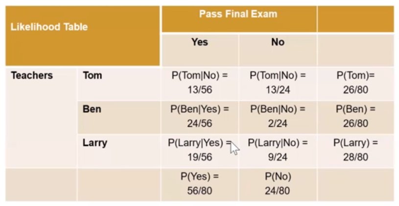

We want to know the prior of passing your exam if your teacher is Larry. We need the following. Let's also replace the P(x) and alike with semantics for this.
> P(x) = P(Larry) = 28/80 = 0.35
> P(y) = P(Yes) = 56/80 = 0.7 
> P(x|y) = P(Larry|Yes) = 19/56 = 0.34 (Prior of your teacher being larry if you passing.)

Ok so with that we can calculate P(y|x) like P(y|x) = `P(y|x) = P(|y)p(x)/p(y)` or `P(Yes|Larry) = P(Larry|Yes)*P(Larry)/P(Yes)`
So if we write it out: `P(Yes|Larry) = 0.34*0.7/0.35 = 0.68` Meaning the final probabilty of passing the exam if your theater is larry is 0.68

# Naive Bayes 
With a the rules from above you can make a machine learning classifier. It is called Naive Bayes classifier. This is a **generative** based classifier. Meaning it builds a generative statistical model based on the data. This classifier is based on the predictions of that model. We do this by just giving the things below we saw before new names.

>- P(y|x): The posterior probability of a class (label) given the data (attribute) -> The probability of the label given the data
>- P(y): The prior probability of a label -> How likely is a certain class?
>- P(x|y): The likelihood of the data given the class -> Prior Probability of the data given a class. Opposite of (y|x)
>- P(x): The prior probability of the data

We are after P(y|x) the label given the data. We can calculate this with P(y|**x**) = P(**x**|y)*P(y)/P(**x**).

In practice, you will always have multiple features so it looks like P(y|**X1** ... **Xn**)

This classifier is called a **Naive** Bayes because it assumes that all the features are independent. This makes it so you P(**X1**|y, **X2**, **X3**...**Xn**) = P(**X1**|y)

This gives us: 

P(y|X1...Xn) = 


His means multiply P(y) with all the priors of your classes and divide by the joint prior of all the data. Then you take the class with the highest **posterior probability**. This is what you choose as your prediction.

> **posterior probability** is the prior * likelyhood or the P(y) * P(**x**|y) of the equation. So we want the highest P(y|x)

### Non discrete data
So far we assumed that the data is always discrete but usually with machine learning this is not the case. The data is often continues. For these types of data we often use a **Gausian model** that assumes your data is normally distributed! In this model we assume that the input X is taken from a normal distribution X = N(mean, sigma). 

## Bayesian Regression
So far we only looked at Bayesian classification. You can also do Bayesian regression. Take linear regression and just put it in the Bayesian model. You base the predictions on probability instead of a single point. You can optimise these with gradient decent even still. and there are multiple best values. You are more after the posterior distribution for the model parameters.  

>**Linear regresssion reminder:**
> 
> y(x) = **W**^T**x** (frequentst view )
>
> Cost (sum of squares): y(W) = 0/2N*Sum(y(x<sub>i</sub>)-y<sub>i</sub>) 
> 
> <u>Predicted - what you found</u>

With bayesian linear regression you formulate linear regression using probability distributions rather than point estimates. This assumes that y was drawn
 from a probability distribution. The sklearn linear regression can actually use baysion regression for regression as well as it is build in.  


So this is just linear regression in Bayesian pretty cool if you ask me its like a whole another way of looking at things.

### Different scikit learn bayes models
There are different implementations of native bayes. The one you want to use depends on the type of your data.
- Gaussian Naive Bayes classifier (FaussianNB())
  - Assumes that features follow a normal distribution 
- Multinomial Naive Bayes 
  - Assumes count data
  - Each feature represents how often something happens. Like how often does a word appear in a sentence.
- Bernoulli Naive Bayes
  - Assumes your feature vectors are binary (Can only take 2 values)
  - Can also be continues values which are precisely split. Like Below 10 is 0 and above 10 is 1.
## Advantages and Disadvantages of Naive Bayes. 
- Advantages:
    - Simple
    - Works well with a small amount of training data
    - The class with the highest probability is considered as the most likely class
    - You get a probability of all the classes
- Disadvantages:
    - You have to estimate parameters of the normal distribution
    - You data needs to be normally distributed
      
      You can use different ones for different types of data.
  
# Decision Trees 
With this technique the idea is build a large logic tree made out of questions about the input data. Each question is a node in the tree. The answer to a question decides which node you should go to next. For example: Is the feature larger than 32? If yes go left if no go right. Going left or right is called **branching** or **traversing** the tree. A node only askes **one question about one feature**. At the end of the tree there are no question anymore and just your label. This node is also called a **leaf**. 

This technique is like having a lot of if/elif/else statements. You get the label by traversing the tree one node at the time by answering boolean questions about a feature in you data. A nice advantage of this is that decision trees are not at all a black box as you basically have the if statements checking your inputs after you made the model. This makes it easier to share the model. 


> Because the tree is made out of binary questions you don't have to do anything to your data to use it. So you don't have to convert categorical data to something numerical or anything like that as the tree can just directly ask something about a categorical feature. For instance, you can just ask: is the color red? Yes or No. The same thing for numerical values. 
> 
>This is really great as it reduces the preprocessing and it is intuitive.  

Decision trees are a bit like playing guess who:


If you go left you might get to a different question as when you would have gone right. Everytime you branch the tree the **depth** of the tree grows. You want the least depth while separating the data as much as possible. A

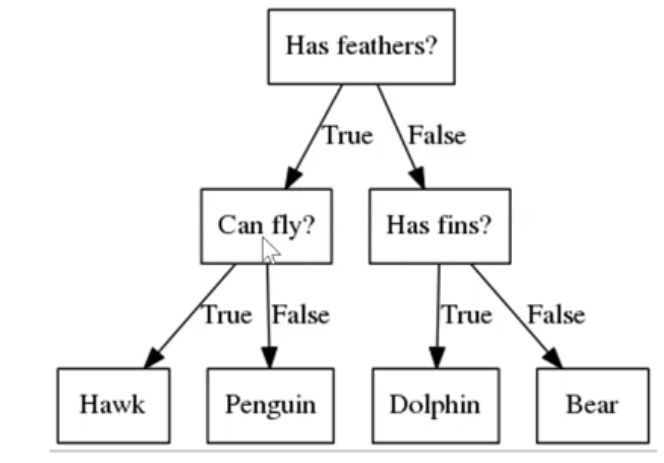

> All decision boundaries are perpendicular to the feature axes, because at each node a decision is made about one feature only. So if you see strait lines it is probably a decision tree.

The goal behind decision trees is to get the best branching. You get the best branching based on the order you check the features and the thresholds you check for.

You want to split as much "area" as possible like this:

 

> Every depth increases the amount of decision boundary lines increases with depth as well if that makes sense. This is because every depth down creates exponentially more paths. You are making your decision boundary and eliminating labels as you go along 
> 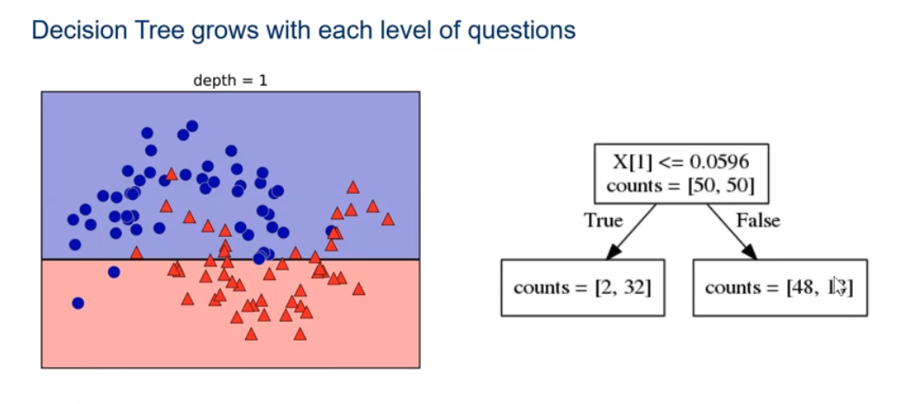 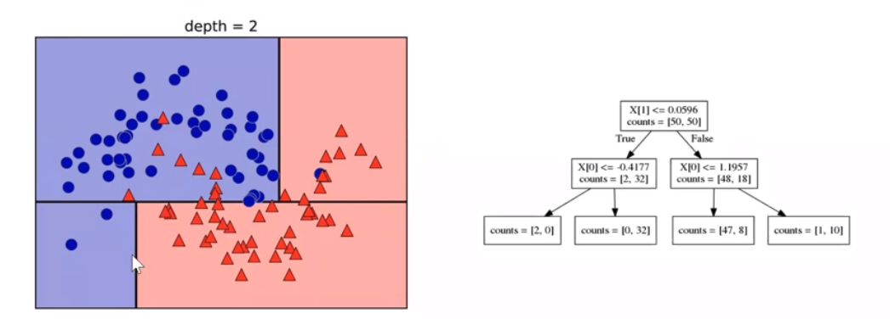 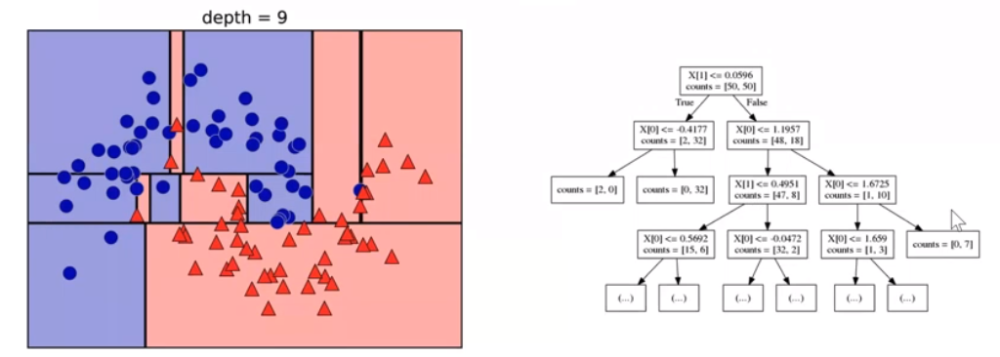 

#### Example 

In this case what is better X1 or X2?

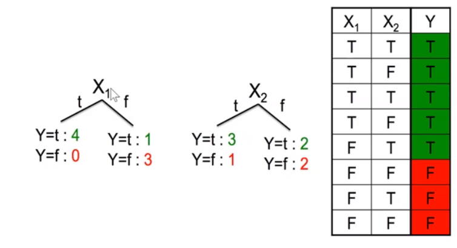

If you split by asking is X1 true of false and it is true then you immediately get the good y. This is the most error reduction with the least depth. As in that case there are still 0 remaining wrong classified outcomes anymore. Thus splitting by X1 first is better. This will then also be indicated by those three measures.

## Choosing how to split your tree
If you have a tree they using it is easy to use but getting the splits is the tricky part. The only way really is just to try a bunch of values/splits and look at some measures to give indication about the improvement the split gives. Then you pick the split that gives the most improvement. For this we use the decision tree algorithm. This algorithm has to decide:
- What features to ask about
- What values to use in the question (Numbers for continues values, categories for categorical values)
- What order to do the splitting in
- Decide what the outputs are if you get to the leafs

The algorithm works like this:
1. Start from an empty decision tree
2. Split on the next best **attribute**
3. Repeat


## Decision tree classification
Ok but what is the next best attribute? For classification, you can determine it based on these three things:
- Entropy
- Information gain
- Gini index

### Entropy
Entropy is **the level of uncertainty**. The higher the entropy the more uncertainty. 
The formula is:


You saw entropy in logistic regression. Entropy is the level of uncertainty. It is the probability of your class occurring giving the log of that probability. That means the chance that any instance is that class. You get that by doing: occurrences feature/n. Entropy can never be negative. Instead of P for Bayes we have H for entropy. 

We want to minimize entropy because we want to minimize uncertainty. 

>Probabilities are always between 0 and 1 so the log of the p will be negative that is why this works. As the lower the p the lower the log results.   
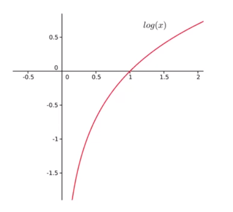

#### Examples of entropy


In this case the entropy is the lowest on the right.
You can also calculate entropy for sequences.

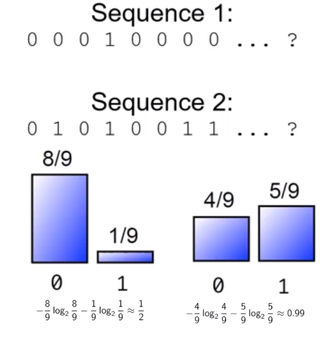

Now here are some more things about entropy she discussed. 

What this shows is that if a sequence is more equal then as in there is an equal division of p between classes then the entropy is higher. This makes entropy the method for dealing with unbalanced data.

<u>The idea of using entropy is to try a split and then to calculate what the entropy is after the split. Take the option that has the **lowest entropy** after the split. This option has the least uncertainty.</u>

#### Joint entropy
To find the entropy of a joint distribution you can use this:


She didn't say anything more about it either. So just use this formula.

#### Conditional entropy
Again we use the joint thing + chain rule to get the conditional rule. Conditional entropy  H(X, Y) = H(X|Y)+H(Y) = H(Y|X) + H(X)
If you try to calculate the entropy of a conditional distribution you do it like this. 

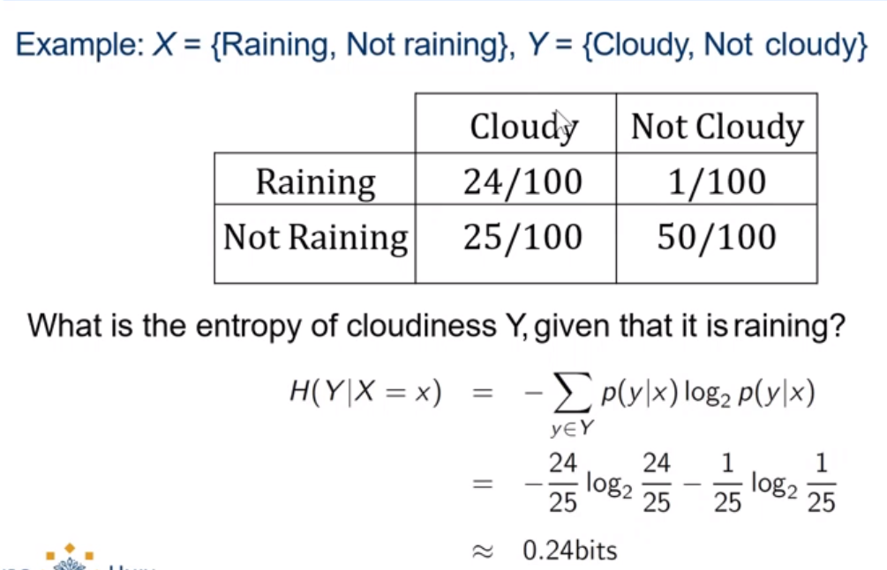

This is asking what is the entropy of X given Y. So instead of likeliness we are after entropy. You can just calculate it with the formula.

#### Dependent vs independent
If X and Y are independent, then X doesn't tell us anything about Y. So H(Y|X) = H(Y). But of course Y tells us everything about Y. H(y|y) = 0.
By knowing X we can decrease uncertainty about Y: H(Y|X) <= H(Y)

### Information gain
With information gain we look for how much information we gain about the features. 
The formula is IG(Y|X) = H(Y) - H(Y|X)

IG(Y|X) is pronounced as information gain in Y due to X. If X is 

If X is completely uninformative about Y then IG(Y|X) = 0
If X is completely uninformative about Y then IG(Y|X) = H(Y) E.G. everything that is uncertain is gone
This is what you use in making the tree. **You want to find the split with the highest information gain.**
> You can see information gain as taking away entropy

### Gini Coefficient


The gini function is called HGini. Gini is cheaper to calculate then entropy because there is entropy has a log operation and Gini does not. This is why this is the default in sklearn. However, Gini only works for binary classification. The idea is the same. Split, fill in the formula, use the split with the lowest gini.

 #### Example:

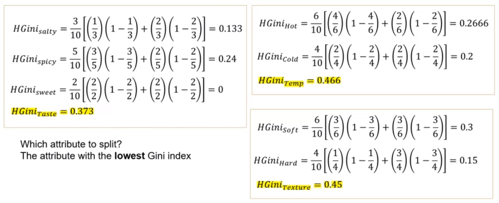

## Thresholds with continues values 
For all of these methods if you have continues values you not only have to try splits but also with different thresholds. Like if X between 10 and 12 or 10 and 13 what gives the best model improvement? 

## Decision Tree Regression
For regression with decision trees you use the **weighted mean square error** to decide on the splits. Try a lot of splits and choose the split that reduces the weighted mean square error the most. 

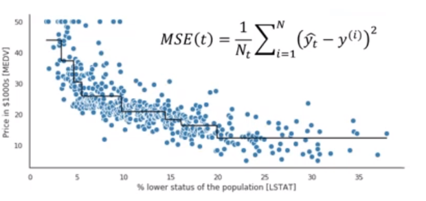

N is the number of training samples at a certain node. y is the true target value y^ is the predicted sample mean. 

As you can see just like with decision tree classification you again get these straight lines in the decision boundary. 

## Complexity of the model 
The tree can get huge quickly. The complexity of a decision tree model is determined by the depth of the tree. **Increasing the depth** of the tree increases the number of decision boundaries and **may lead to overfitting**. For example all these places might have overfitting:

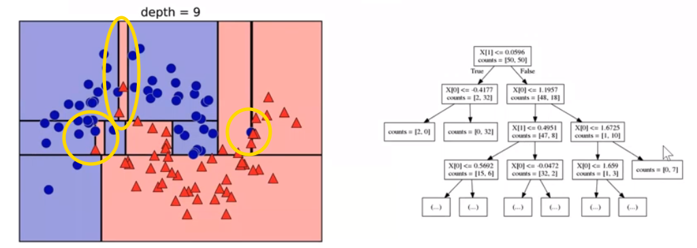

### Ways of reducing model complexity. (hyperparameters)
 There are hyper parameters that limit model complicity. You should set alteast one of these as theoretically you can keep growing the tree forever.
- max_depth = The max depth the tree can grow
- max_leaf_nodes = The maximum leaf nodes that can exist
- min_samples_split = A minimum amount of samples that have to be in a split to make a split.   
There are also more parameters

## Advantages and Disadvantages of decision trees
**Advantages**
- Easy to interpret and make for straightforward visualizations
- The interal workings are capable of being observed and thus makes it possible to easily reproduce work
- Can handle both numerical and categorical data directly without preprocessing
- Performs well on large datasets
- Performs fast in general

**Disadvantages**
- Building decision trees requires algorithms that can find the optimal choice at each node
- Prone to overfitting, especially when the trees' depth increases

# Bias and variance
Before we move on to ensamble learning lets have a reflection moment. 
So far these algorihms were covered:

| Classification      |Regression                     |
|---------------------|-------------------------------|
| Logistic Regresion  | Linear Regression             |
| Linear SVMs         | Linear SVM                    |
| KNN                 | KNN regression                |
| Neural networks     | Polynomial Regression         |
| Kernel SVM          | Decision Trees Regression     |
| Naive Bayes         | Kernel SVM Regression         |
| Decision trees      | Bayesian Linear Regression    |

Some of these are linear, and some of these are not. Linear algorithms create a straight decision boundary line. Non-linear algorithms don't.

These algorithms are known as **weak learners** because they might be sensitive to overfitting. You can overcome this with regularization as we have seen but another way is with ensemble learning. 

The problem that we always have with these models is figuring out how well they will work for unseen data. This problem is called **Estimating Generalization Error**. You can calculate this with: Generalization error = bias^2 + variance + noise

**Error due to Bias:** Bias measures how far off in general these models' predictions are from the correct value.

 **Error due to Variance:** The variance is how much the predictions for a given point vary between different realizations of the model.


Both variance and bias are related to model complexity. If you make your model **less complex** typically you get **less bais but more variance**. If you make your model **more complex** you get **more bais and less variance**. They both contribute to the error, so you want both to be low as possible. Which means you want to find a model complexity that gives a low bais and low variance. It is about finding a balance.   


This was picture made by scott fortmann roe. [He has a nice further explination about the bias and variance tradeoff.](http://scott.fortmann-roe.com/docs/BiasVariance.html)  

A low bias, and a low variance are the two most fundamental features expected for a model.

Here are more charts that show the effect even more! Made by Duda and Hart.

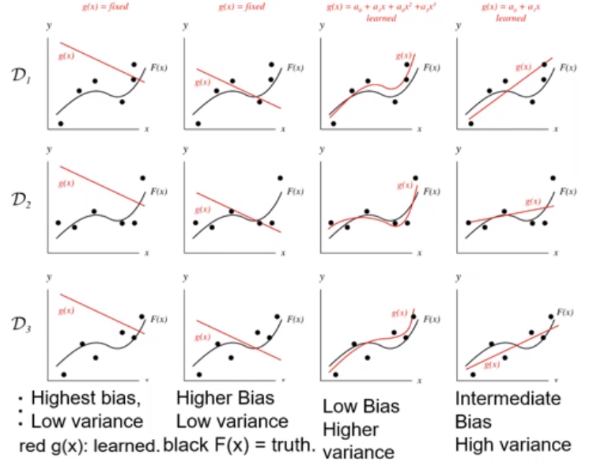

The bais and variance are the cause of the underfitting overfitting problem. Because of it you normally expect model performance to behave like this: 


It seems like the models so far have to deal with this problem. Especially logistic regression, naive bayes, knn, shallow decision trees, linear svm and kernel svm. Some of these have high bias → **low degree of freedom models**. Or they have too much variance to be robust → **high degree of freedom models**. These models do not necessarily perform well by themselves. But who says you can only have 1 model? I don't.

# Ensemble learning
Ensemble methods try to reduce bias and or variance of weak (single) models by combining several of them together to achieve better performance. 

There are 2 main ways of doing this based on the type of model you are using. The methods are called **Bagging** and **Boosting**.

## Bagging
This technique is for low bais and high variance models. You train multiple models on **bootstrapped data** and then take the **average**. This averaing will decrease the variance decrease the variance. 

## Boosting
This technique is for a high bais and low variance models. You combine the models sequentially to reduce the bais. You do this by running multiple weak models multiple times on (reweighted) training data and then let the learned classifiers vote (Gradient Boosting)

But why stop there? We can even combine bagging and boosting again by using 2 other methods. **Voting** and stacking.

## Voting 
Voting is a method were you make multiple models vote on what the output should be. This makes the most sense for classifiers. You just train multiple models. Each model votes on what they think is the correct label. You pick the label with the most votes.

## Stacking 
Trains many models in parallel and combines them by training on a meta model to output a prediction based on different weak models predictions. 
